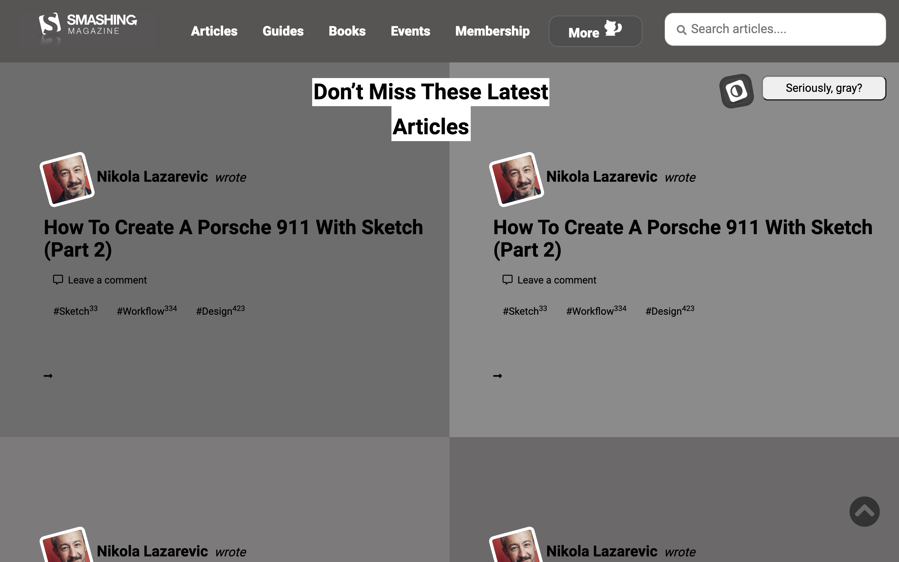

# design-teardown

> This project consists of building a heatmap of the Smashing magazine website.

## Built With

- HTML,
- CSS

## Live Demo

[Live Demo Link](https://raw.githack.com/Adewunmi97/design-teardown/homepage/index.html)

## Authors

👤 **Author1**

- Github: [@jrai0792](https://github.com/jrai0792)

👤 **Author2**

- Github: [@Adewunmi97](https://github.com/Adewunmi97)

## Show your support

Give a ⭐️ if you like this project!

## 📝 License

This project is [MIT](lic.url) licensed.
